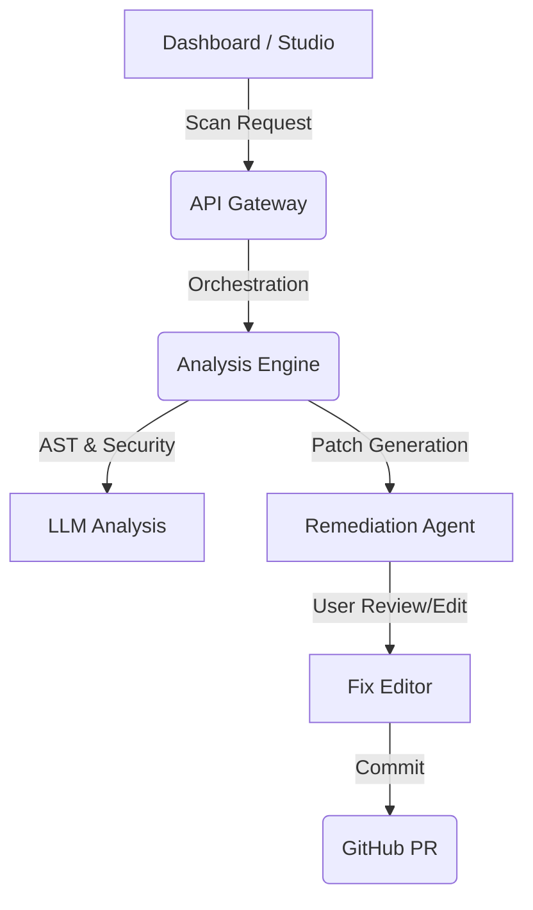

# AtlasStack

[](LICENSE)
[](https://www.python.org)

AtlasStack is an autonomous software engineering engine that analyzes GitHub repositories using **Gemini 1.5 Flash** and **Qwen2.5-Coder**. It bridges the gap between static analysis and actual remediation by providing a high-velocity "Scan-to-PR" workflow.

---

##  The High-Velocity Workflow

AtlasStack is designed for engineering speed. No more jumping between tools to fix security or architectural debt.

1.  **Autonomous Scan**: Trigger a deep repository analysis from the Studio or CLI.
2.  **Instant Findings**: Results **auto-popup** the moment the AI finishes, mapping architecture, risk, and dependencies.
3.  **Human-in-the-Loop Remediation**: Review AI-suggested patches in an embedded editor. Modify the code directly in your browser to match your team's standards.
4.  **One-Click PR**: Ship the verified fixes as a professional Pull Request directly to GitHub.

---

##  Key Features

- **Liquid Glass Dashboard**: A premium, high-contrast engineering interface with real-time scan queues and live status polling.
- **Embedded Fix Editor**: Modify AI suggestions before they ever touch your codebase.
- **PR Generation Engine**: Automated PR creation with support for custom code overrides.
- **"Explain Like I'm 10"**: Toggleable ELI5 summaries to help every stakeholder understand complex architectural risks.
- **Clerk Identity Integration**: Seamless, secure authentication with built-in GitHub profile synchronization.
- **Production-Grade Security**: Hardened with strict regex URL validation, SSRF protection, and secure JWT handling.

---

##  Tech Stack

### Core Platform
- **Frontend:** React, TypeScript, Vite, Framer Motion, Monaco Editor (Fix Editing)
- **Backend (Lite Mode):** FastAPI, SQLite, Python 3.12+
- **Auth:** Clerk (Identity) + GitHub OAuth
- **AI Models:** Gemini 1.5 Flash (Primary) + Qwen2.5-Coder (Fallback/Specialized)

---

##  Quick Start

### Prerequisites
- Python 3.12+
- Node.js 18+
- A **[Gemini API Key](https://aistudio.google.com/app/apikey)** (Highly Recommended)
- A **GitHub Personal Access Token** (Classic, with `repo` scope)

### 1) Setup Environment
Copy the example environment files and add your keys:
```bash
cp .env.example .env
# At minimum, set:
# GEMINI_API_KEY=your_key
# GITHUB_TOKEN=ghp_your_pat
```

### 2) Start the Backend
AtlasStack uses a specialized "Lite Mode" entry point for high-velocity development:
```bash
python codesage-improved/test_app2.py
# → http://localhost:8000
```

### 3) Start the Frontend
```bash
cd codesage-improved/clients/web
npm install
npm run dev
# → http://localhost:3000
```

---

##  Configuration Reference

| Variable | Description |
|----------|-------------|
| `GEMINI_API_KEY` | Google Gemini API Key (Required for high-quality analysis) |
| `GITHUB_TOKEN` | Your Personal Access Token (Required for Pull Request creation) |
| `HF_TOKEN` | HuggingFace Token (Alternative to Gemini) |
| `LITE_MODE` | Set to `true` to run on local SQLite (Default) |
| `JWT_SECRET` | Secret for JWT signing (Required for production) |

---

##  Architecture

AtlasStack coordinates specialized agents via a central API Gateway to handle the full lifecycle of a code fix.



---

## 📄 License

Apache License 2.0 — see [LICENSE](LICENSE) for details.
