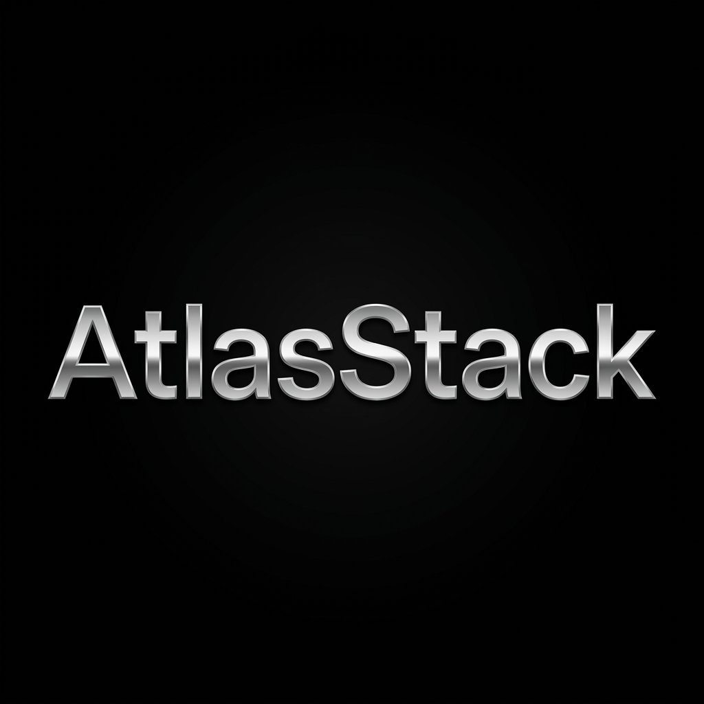
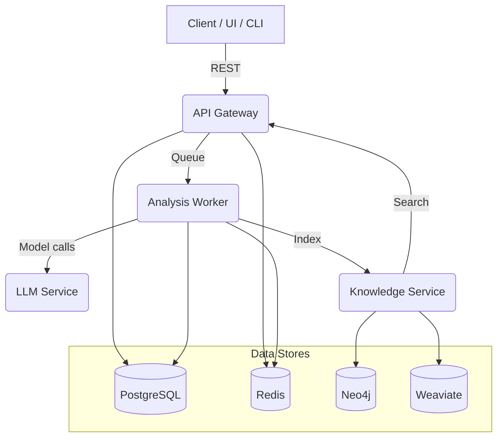

<p align="center">
  
</p>

# AtlasStack

[](LICENSE)
[](https://www.python.org)

AtlasStack is an autonomous software engineering engine that analyzes GitHub repositories using **Qwen2.5-Coder**, finds bugs, explains architecture, and proposes fixes — including an embedded web IDE experience.

---

##  Highlights

- **Deep Repo Analysis:** Clones any public GitHub repo and produces a structured report: architecture, data flow, important files, security fixes, and a health score.
- **Embedded Web IDE:** A full VS Code-like development environment directly in the browser.
- **"Explain Like I'm 10":** Toggleable ELI5 summaries for every codebase analysis.
- **Lite Mode Backend:** Runs entirely on Python + SQLite — no Docker needed.
- **Real Auth:** User registration, bcrypt password hashing, JWT tokens, analysis history saved per user.

---

## Screenshots

### Landing Page


---

##  Architecture

AtlasStack is built as a distributed system of specialized services coordinated via an API Gateway.



For more details, see the [Architecture Deep Dive](docs/architecture.md).

---

##  Tech Stack

### Core
- **Frontend:** React, TypeScript, Vite, Monaco Editor, Tailwind CSS, Framer Motion
- **Backend (Lite Mode):** Python 3.12, FastAPI, SQLite, Qwen2.5-Coder via HuggingFace Inference API

### Enterprise Infrastructure (Optional)
- **Message Broker:** RabbitMQ
- **Graph Database:** Neo4j (Code dependency maps)
- **Vector Database:** Weaviate (Semantic code search)
- **Caching & Sessions:** Redis
- **Primary Data:** PostgreSQL
- **Observability:** Prometheus, Grafana, Jaeger (Tracing)
- **Orchestration:** Docker Compose, Kubernetes

---

## Quick Start (Lite Mode — no Docker)

### Prerequisites
- Python 3.12+
- Node.js 18+
- A [HuggingFace token](https://huggingface.co/settings/tokens) with Inference API access

### 1) Configure environment

```bash
cp .env.example .env
# Edit .env — at minimum set HF_TOKEN and JWT_SECRET
```

### 2) Install Python dependencies

```bash
pip install -r services/api/requirements.txt
```

### 3) Start the backend (Lite Mode)

```bash
python test_app2.py
# → http://localhost:8005
# → API docs at http://localhost:8005/docs
```

### 4) Start the frontend

```bash
cd clients/web
npm install
npm run dev
# → http://localhost:3000
```

### 5) Use it

1. Open [http://localhost:3000](http://localhost:3000)
2. Click **Sign In / Register** → create an account
3. Enter a public GitHub repo URL and click **Start Analysis**
4. The AI will clone the repo, analyze it, and return a full report

> **No HF_TOKEN?** The analysis endpoint falls back to a mock response. Set `HF_TOKEN` in `.env` to enable real AI analysis.

---

##  IDE Integration

### Visual Studio Code
The AtlasStack VS Code extension brings AI-driven analysis directly to your workspace.

1.  **Build/Install:** Open [clients/vscode](clients/vscode) and follow the README to build the `.vsix`.
2.  **Connect:** Open VS Code settings and set `atlasstack.serverUrl` to your backend (default: `http://localhost:8005`).
3.  **Analyze:** Use the AtlasStack icon in the Activity Bar to run deep repository scans.

---

## API Endpoints

| Method | Path | Auth | Description |
|--------|------|------|-------------|
| POST | `/api/v1/auth/register` | No | Create account |
| POST | `/api/v1/auth/login` | No | Login, get JWT |
| POST | `/api/v1/auth/refresh` | No | Refresh token pair |
| POST | `/api/v1/analysis/mvp` | No | Full repo analysis |
| GET | `/api/v1/analyses` | Yes | List your past analyses |
| GET | `/api/v1/analyses/{id}` | Yes | Get analysis detail |
| POST | `/api/v1/repositories` | Yes | Register a repo |
| GET | `/api/v1/repositories` | Yes | List your repos |
| POST | `/api/v1/repositories/{id}/analyze` | Yes | Trigger analysis |
| GET | `/health` | No | Health check |

Full interactive docs at `http://localhost:8005/docs`

---

## Project Layout

```
atlasstack/
├── clients/
│   ├── web/              # Vite + React frontend (landing page + IDE)
│   └── vscode/           # VS Code extension
├── services/
│   ├── api/              # FastAPI gateway (auth, repos, analysis)
│   ├── analysis/         # Celery workers (AST, security, perf)
│   ├── llm/              # LLM inference service
│   └── knowledge/        # Neo4j + Weaviate knowledge graph
├── shared/               # Shared Pydantic models + utilities
├── k8s/                  # Kubernetes manifests
├── monitoring/           # Prometheus + Grafana + Jaeger configs
├── test_app2.py          # Lite Mode entry point
└── docker-compose.yml    # Full stack deployment
```

---

##  AI Model Training

AtlasStack supports custom model fine-tuning via [training/](training). You can run the pipeline to adapt the analysis engine to specific coding standards or languages.

```bash
# Run Supervised Fine-Tuning (SFT)
make train-sft

# Run RLHF pipeline
make train-rlhf
```

---

##  Developer Reference

### Makefile Commands

| Command | Description |
|---------|-------------|
| `make up` | Start full Docker stack |
| `make test` | Run unit + integration tests |
| `make lint` | Run flake8 and pylint |
| `make format` | Format code with black/isort |
| `make benchmark` | Run performance test suite |
| `make clean` | Remove all containers & cache |

---

##  Configuration Reference

| Variable | Default | Description |
|----------|---------|-------------|
| `HF_TOKEN` | - | HuggingFace Token (required for real AI) |
| `LITE_MODE` | `true` | Toggle between SQLite and full Postgres stack |
| `JWT_SECRET` | - | Secret key for auth tokens |
| `DEFAULT_MODEL` | `Qwen2.5-Coder` | The LLM used for analysis |
| `NEO4J_PASSWORD` | - | Password for graph database |

See `.env.example` for the full list of configuration options.

---

## Enterprise Deployment (Docker)

```bash
cp .env.example .env
# Fill in all values in .env
make up
```

See `Makefile` for all available commands (`make help`).

---

## Security Notes

- Passwords are hashed with **bcrypt** — never stored in plaintext
- JWT tokens expire after 24 hours (configurable via `JWT_EXPIRATION_HOURS`)
- **Always change `JWT_SECRET`** before any real deployment
- Repository analysis runs in a temp directory that is deleted after completion

---

## License

Apache License 2.0 — see [LICENSE](LICENSE) for details.
