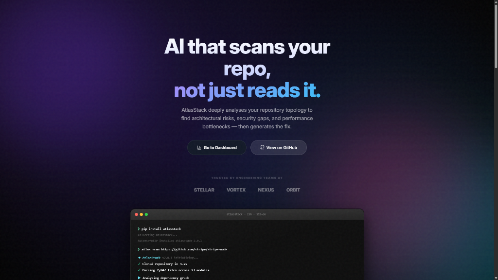
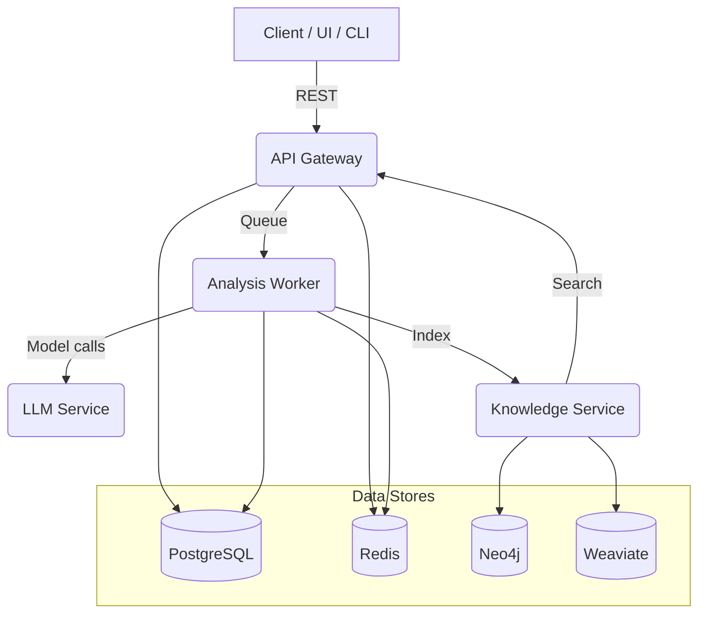

# AtlasStack

[](LICENSE)
[](https://www.python.org)

AtlasStack is an autonomous software engineering engine that analyzes GitHub repositories using **Gemini 1.5 Flash** and **Qwen2.5-Coder**, finds bugs, explains architecture, and proposes fixes — including an embedded web IDE experience.

---

##  Highlights

- **Production-Grade Security:** Hardened with strict regex URL validation, SSRF protection against internal metadata endpoints, and secure JWT handling.
- **Resilient AI Orchestration:** Enforced mandatory timeouts (30s for Git, 120s for LLM) and defensive error handling for sub-engines to ensure 99.9% system uptime.
- **Flexible Data Layer:** "Secure by Default" architecture with lazy-loading database engines—seamlessly toggle between SQLite for local dev and PostgreSQL for production.
- **Observability & Probes:** Kubernetes-ready with standard `/health/live` and `/ready` probes, plus integrated structured logging via `structlog`.
- **"Explain Like I'm 10":** Toggleable ELI5 summaries for every codebase analysis.
- **Embedded Web IDE:** A full VS Code-like development environment directly in the browser.
- **Terminal CLI:** Analyze repositories and view history directly from your terminal.
- **Autonomous Training Data Collection:** Captures scan inputs and LLM outputs to build a high-quality fine-tuning dataset automatically.


---

## Screenshots

### Landing Page



---

##  Architecture

AtlasStack is built as a distributed system of specialized services coordinated via an API Gateway.



For more details, see the [Architecture Deep Dive](docs/architecture.md).

---

##  Tech Stack

### Core
- **Frontend:** React, TypeScript, Vite, Monaco Editor, Tailwind CSS, Framer Motion
- **Backend (Lite Mode):** Python 3.12, FastAPI, SQLite, Gemini 1.5 Flash (Google) or Qwen2.5-Coder (HuggingFace)

### Enterprise Infrastructure (Optional)
- **Message Broker:** RabbitMQ
- **Graph Database:** Neo4j (Code dependency maps)
- **Vector Database:** Weaviate (Semantic code search)
- **Caching & Sessions:** Redis
- **Primary Data:** PostgreSQL
- **Observability:** Prometheus, Grafana, Jaeger (Tracing)
- **Orchestration:** Docker Compose, Kubernetes

---

## Quick Start (Lite Mode — no Docker)

### Prerequisites
- Python 3.12+
- Node.js 18+
- A **[Gemini API Key](https://aistudio.google.com/app/apikey)** (Recommended) or a [HuggingFace token](https://huggingface.co/settings/tokens)

### 1) Configure environment

```bash
cp .env.example .env
cp clients/web/.env.example clients/web/.env.local
# Edit .env — at minimum set HF_TOKEN
# Edit clients/web/.env.local — set VITE_CLERK_PUBLISHABLE_KEY
```

### 2) Install Python dependencies

```bash
# Recommended: Use a virtual environment
python -m venv .venv
.\.venv\Scripts\Activate.ps1

pip install -r requirements.txt
pip install -e .  # Registers the 'atlas' command
```

### 3) Start the backend (Lite Mode)

```bash
python app.py litemode
# or, after install: app litemode
# → http://localhost:8000
# → API docs at http://localhost:8000/docs
```

### 4) Start the frontend

```bash
cd clients/web
npm install
npm run dev
# → http://localhost:3000
```

### 5) Use it

1. Open [http://localhost:3000](http://localhost:3000)
2. Click **Sign In / Register** → create an account
3. Enter a public GitHub repo URL and click **Start Analysis**
4. The AI will clone the repo, analyze it, and return a full report

> **No AI Key?** The analysis endpoint falls back to a mock response. Set `GEMINI_API_KEY` or `HF_TOKEN` in `.env` to enable real AI analysis.

---

## GitHub Integration & Auto-Fix

AtlasStack can connect to your GitHub account (OAuth) to list your repositories — including private repos — and open pull requests that apply suggested fixes.

Quick notes:
- Frontend path: `clients/web` contains the UI changes (Connect GitHub button and repo list).
- Backend endpoints:
  - `POST /api/v1/auth/github/login` — returns the GitHub authorize URL.
  - `POST /api/v1/auth/github/callback` — exchange code and store encrypted token.
  - `GET /api/v1/auth/github/repos` — list repositories for the signed-in user.
  - `POST /api/v1/analyses/{id}/fixes/{index}/pr` — create a PR for a single suggested fix.
  - `POST /api/v1/analyses/{id}/fixes/apply_all` — create one PR that applies all suggested fixes from an analysis (new).

Environment requirements:
- `ENCRYPTION_KEY` (recommended): when set, GitHub tokens are encrypted in the database using Fernet. If omitted, tokens may be stored plaintext — set this in production.
- GitHub OAuth App: configure your OAuth App's Redirect URI to point to your frontend origin (e.g. `http://localhost:3000`). Ensure requested scopes include `repo` so private repositories can be listed and PRs created.

How to use (dev):
1. Start backend and frontend as in Quick Start above.
2. In the web UI, sign in and click **Connect GitHub** on the Dashboard.
3. Authorize the app; after callback the dashboard will list your repositories.
4. Run an analysis on a repository; in the IDE header click **Apply All Fixes** to create a single PR with all suggested fixes.

Security: the server validates repository URLs and uses strict cloning timeouts. PR creation uses the user's stored token (decrypted with `ENCRYPTION_KEY`) or the configured GitHub App fallback token.

---

##  IDE Integration

### Visual Studio Code
The AtlasStack VS Code extension brings AI-driven analysis directly to your workspace.

1.  **Build/Install:** Open [clients/vscode](clients/vscode) and follow the README to build the `.vsix`.
2.  **Connect:** Open VS Code settings and set `atlasstack.serverUrl` to your backend (default: `http://localhost:8005`).
3.  **Analyze:** Use the AtlasStack icon in the Activity Bar to run deep repository scans.

---

##  Terminal CLI

The AtlasStack CLI is a powerful tool for developers who live in the terminal.

### Installation & Setup

1. **Create Environment**:
   ```bash
   python -m venv .venv
   .\.venv\Scripts\Activate.ps1  # Windows
   # source .venv/bin/activate   # macOS/Linux
   ```

2. **Install CLI**:
   ```bash
   pip install -r requirements.txt
   pip install -e .
   ```

### Command Reference

| Command | Description |
|---------|-------------|
| `atlas scan .` | Scan the current local directory |
| `atlas analyze <url>` | Analyze a remote GitHub repository |
| `atlas history` | View your past analysis records |
| `atlas view <id>` | See detailed results for a specific scan |
| `atlas config` | Update your Hugging Face credentials |

---

## API Endpoints

| Method | Path | Auth | Description |
|--------|------|------|-------------|
| POST | `/api/v1/analysis/mvp` | No | Full repo analysis |
| GET | `/api/v1/analyses` | Yes | List your past analyses |
| GET | `/api/v1/analyses/{id}` | Yes | Get analysis detail |
| GET | `/api/v1/languages` | No | List supported languages |
| GET | `/api/v1/rules` | Yes | List security scan rules |
| POST | `/api/v1/repositories` | Yes | Register a repo |
| GET | `/api/v1/repositories` | Yes | List your repos |
| POST | `/api/v1/repositories/{id}/analyze` | Yes | Trigger analysis |
| GET | `/health/live` | No | Liveness probe (200 OK) |
| GET | `/ready` | No | Readiness probe (DB check) |


Full interactive docs at `http://localhost:8005/docs`

---

## Project Layout

```
atlasstack/
├── clients/
│   ├── web/              # Vite + React frontend (landing page + IDE)
│   └── vscode/           # VS Code extension
├── services/
│   ├── api/              # FastAPI gateway (auth, repos, analysis)
│   ├── analysis/         # Celery workers (AST, security, perf)
│   ├── llm/              # LLM inference service
│   └── knowledge/        # Neo4j + Weaviate knowledge graph
├── shared/               # Shared Pydantic models + utilities
├── k8s/                  # Kubernetes manifests
├── monitoring/           # Prometheus + Grafana + Jaeger configs
├── test_app2.py          # Lite Mode entry point
└── docker-compose.yml    # Full stack deployment
```

---

##  AI Model Training

AtlasStack supports custom model fine-tuning via [training/](training). You can run the pipeline to adapt the analysis engine to specific coding standards or languages.

```bash
# Run Supervised Fine-Tuning (SFT)
make train-sft

# Run RLHF pipeline
make train-rlhf
```

### Autonomous Data Collection

AtlasStack can automatically harvest its own analysis results to build a specialized dataset for future training.

- **Storage**: Data is saved in [JSONL format](https://jsonlines.org/) for easy ingestion by the `DatasetLoader`.
- **Default Path**: `training/datasets/collected_scans.jsonl`
- **Toggle**: Enable or disable via `COLLECT_TRAINING_DATA` in your `.env`.

Every collected entry includes the system **instruction**, the repository **context**, and the structured **LLM response**, along with metadata like the repo URL and scan timestamp.

---

##  Developer Reference

### Makefile Commands

| Command | Description |
|---------|-------------|
| `make up` | Start full Docker stack |
| `make test` | Run unit + integration tests |
| `make lint` | Run flake8 and pylint |
| `make format` | Format code with black/isort |
| `make benchmark` | Run performance test suite |
| `make clean` | Remove all containers & cache |

---

##  Deployment Guide

### Docker Compose (Production-ready)
For a full enterprise-grade deployment with PostgreSQL, Redis, and RabbitMQ:

1.  **Prepare Environment:**
    ```bash
    cp .env.example .env
    # Fill in required secrets (HF_TOKEN, DATABASE_URL, etc.)
    ```
2.  **Launch Stack:**
    ```bash
    docker-compose up -d
    ```
3.  **Run Migrations:**
    ```bash
    docker-compose exec api alembic upgrade head
    ```

### Kubernetes (K8s)
Deployment manifests are located in `/k8s`.
```bash
kubectl apply -f k8s/
```

---

## 🔧 Troubleshooting

| Issue | Solution |
|-------|----------|
| **White Screen in IDE** | Ensure `Cross-Origin-Opener-Policy` headers are set. Check browser console for Clerk errors. |
| **Analysis Timed Out** | Increase `MAX_ANALYSIS_TIME` in `.env`. Default is 300s. |
| **"git clone" fails** | Verify the repository is public or your `GITHUB_TOKEN` has proper scopes. |
| **Database connection error** | If using `LITE_MODE=false`, ensure PostgreSQL is running and `DATABASE_URL` is correct. |
| **Alembic migration failed** | Run `ENVIRONMENT=development alembic upgrade head` to see detailed logs. |

---

##  Configuration Reference

| Variable | Default | Description |
|----------|---------|-------------|
| `HF_TOKEN` | - | HuggingFace Token (required for real AI) |
| `GEMINI_API_KEY` | - | Google Gemini API Key (Recommended) |
| `ENVIRONMENT` | `production` | Set to `development` for verbose logging and bypass strict security checks |
| `JWT_SECRET` | - | Secret for JWT signing (Required in production) |
| `LITE_MODE` | `true` | Toggle between SQLite and full Postgres stack |
| `VITE_CLERK_PUBLISHABLE_KEY` | - | Clerk Public Key for Frontend Auth |
| `DEFAULT_MODEL` | `Qwen2.5-Coder` | The LLM used for analysis |
| `COLLECT_TRAINING_DATA` | `true` | Toggle scan data harvesting |
| `RATE_LIMIT_REQUESTS` | `100` | Max requests per window |
| `RATE_LIMIT_WINDOW` | `60` | Window size in seconds |

See `.env.example` for the full list of configuration options.

---

## Security Notes

- **Authentication:** All user authentication, session management, and SSO is handled securely via **Clerk** (frontend) and **JWT** (backend).
- **Vulnerability Scanning:** CI/CD includes automated scans via `bandit`, `safety`, and `semgrep`.
- **Secure Repository Ingestion:** Git cloning is protected by strict regex validation and domain allowlisting (GitHub, GitLab, Bitbucket).
- **SSRF Protection:** Built-in safeguards against Server-Side Request Forgery targeting localhost or cloud metadata services.
- **Execution Sandboxing:** Repository analysis runs in isolated temporary directories with mandatory 30s git timeouts and 120s AI timeouts.
- **LLM Data Privacy:** Local LLM inference via Lite Mode ensures your codebase never leaves your infrastructure (unless using external HuggingFace/Google Inference APIs).


---

## License

Apache License 2.0 — see [LICENSE](LICENSE) for details.
